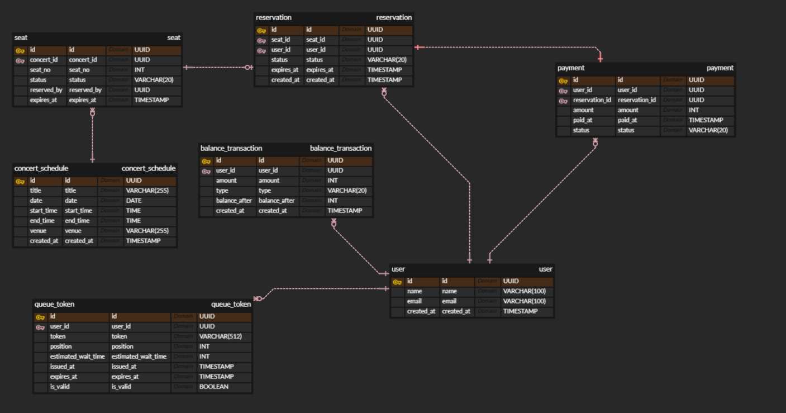
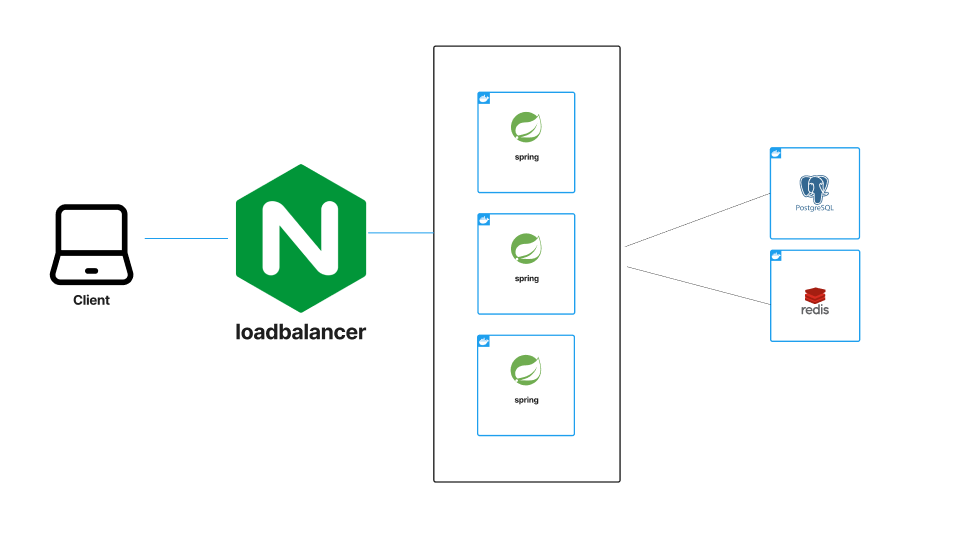

## 프로젝트

## Getting Started

### Prerequisites

#### Running Docker Containers

`local` profile 로 실행하기 위하여 인프라가 설정되어 있는 Docker 컨테이너를 실행해주셔야 합니다.

```bash
docker-compose up -d
```

[API 명세서 바로가기 (Notion)](https://jasper-particle-654.notion.site/27e17729d8de8008b1f4fc0088d8beae?source=copy_link)

<br>


<br>

